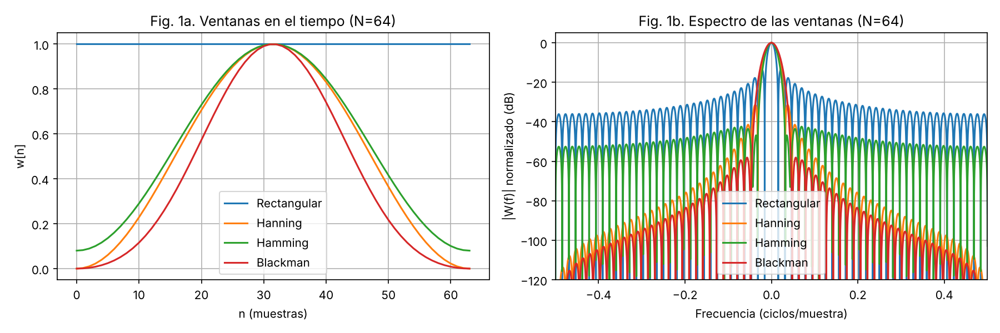
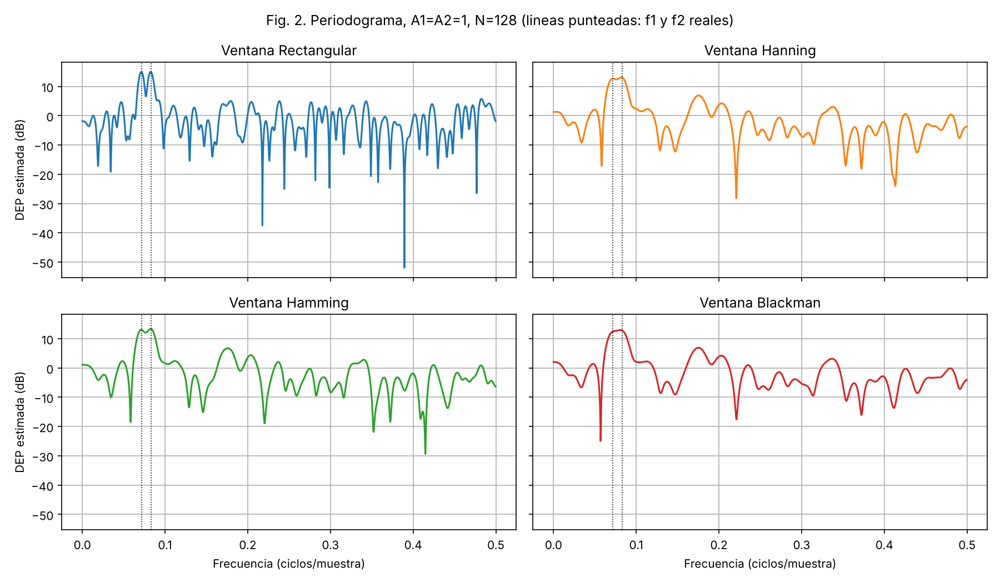
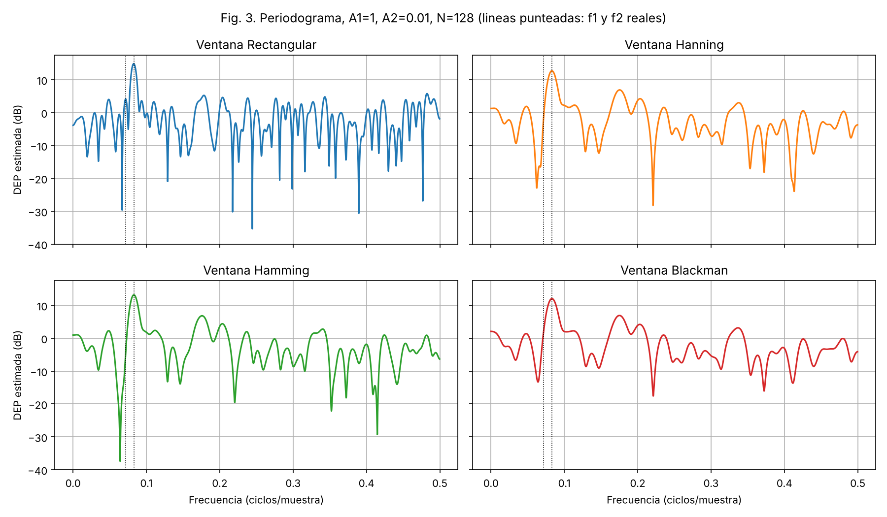
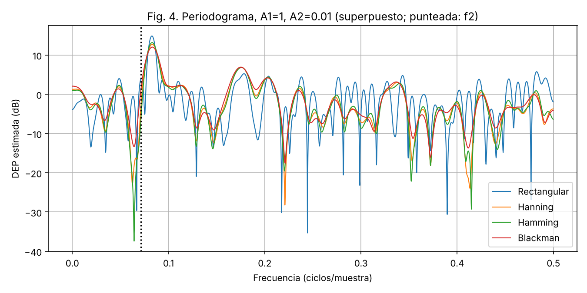
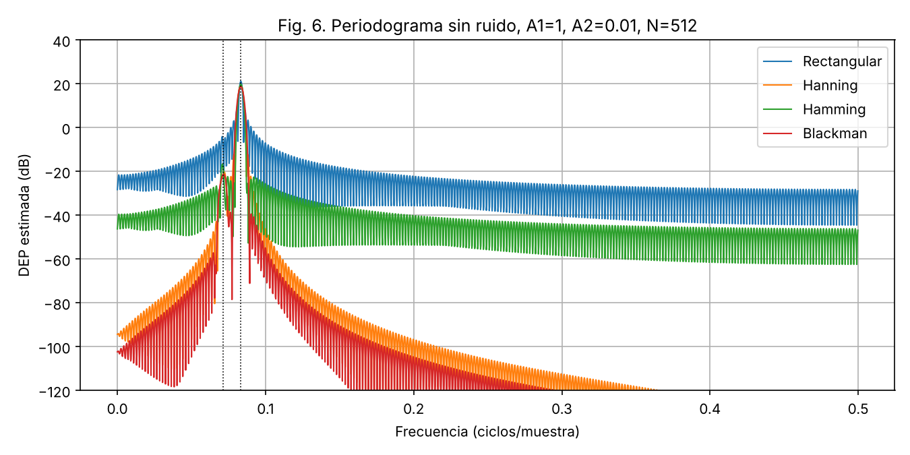
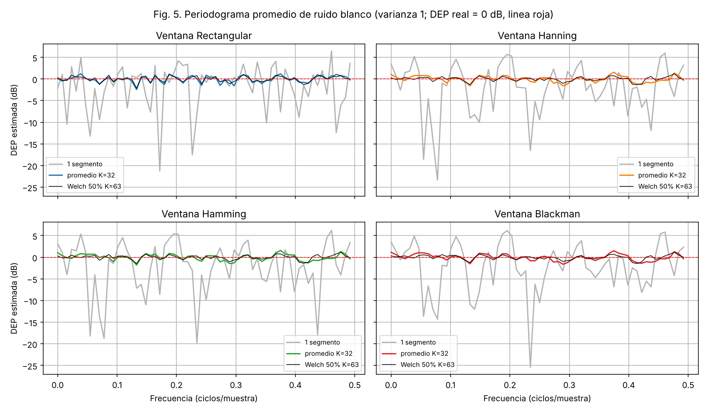

# Estimación espectral clásica: efecto de la ventana en el periodograma

**Objetivo.** Simular la estimación espectral clásica de una señal y comparar el periodograma y el periodograma promedio usando las ventanas Rectangular, Hanning, Hamming y Blackman.
Código: `estimacion_espectral.py` (Python, numpy + matplotlib, con comentarios). Semilla fija, resultados reproducibles.

## 1. Características de las ventanas

Ancho del lóbulo principal medido numéricamente (N = 64, FFT de 2^18 puntos), expresado en múltiplos de 1/N ciclos/muestra:

| Ventana | Ancho lóbulo principal (nulo a nulo) | Ancho a −3 dB | Lóbulo secundario máx. (relativo al principal) |
|---|---|---|---|
| Rectangular | 2·(1/N) ≈ 2.00/N | 0.88/N | −13.3 dB |
| Hanning | ≈ 4/N | 1.46/N | −31.5 dB |
| Hamming | ≈ 4/N | 1.31/N | −42.4 dB |
| Blackman | ≈ 6/N | 1.67/N | −58.1 dB |



*Fig. 1. Ventanas en el tiempo (a) y su espectro en dB (b).*

Hay una compensación (trade-off): al suavizar los extremos de la ventana baja el nivel de los lóbulos laterales, pero el lóbulo principal se ensancha (peor resolución). Además, Hanning y Blackman tienen lóbulos laterales que decaen rápido con la frecuencia; en Rectangular y Hamming decaen poco (Hamming tiene el menor primer lóbulo lateral de las tres no rectangulares, pero sus lóbulos lejanos no decaen).

## 2. Experimento 1.a: A1 = A2 = 1

x[n] = cos(w1 n) + cos(w2 n) + v[n], w1 = 2π/12, w2 = 2π/14, v ~ N(0,1), N = 128.
Separación de frecuencias: Δf = 1/12 − 1/14 ≈ 0.0119 ciclos/muestra ≈ 1.5/N.



*Fig. 2. Periodograma con cada ventana (A1 = A2 = 1). Líneas punteadas: frecuencias reales.*

**Análisis.**
- **Rectangular:** resuelve claramente las dos sinusoides (dos picos separados), porque su lóbulo principal es el más estrecho (ancho a −3 dB ≈ 0.88/N, menor que la separación Δf ≈ 1.5/N).
- **Hanning, Hamming, Blackman:** los dos picos se funden en uno solo ancho (aparece una "meseta"): su lóbulo principal (4/N a 6/N) es mayor que la separación Δf ≈ 1.5/N, así que **pierden resolución**.
- A cambio, el resto del espectro (ruido) es más suave y con menos picos espurios que el de la ventana rectangular.
- Los picos están a unos 13–15 dB, de acuerdo con N·A²/4 ≈ 15 dB para la rectangular; las ventanas con ganancia coherente menor muestran picos algo más bajos (12–13 dB).

## 3. Experimento 1.b: A1 = 1, A2 = 0.01



*Fig. 3. Periodograma con cada ventana (A1 = 1, A2 = 0.01).*



*Fig. 4. Las cuatro ventanas superpuestas.*

Piso de ruido medio (f > 0.3) y máximo: Rectangular −2.9 dB / 5.8 dB; Hanning −5.2 / 3.0; Hamming −5.2 / 2.8; Blackman −4.5 / 3.2.

**Análisis.**
- La segunda sinusoide tiene potencia A²/2 = 5·10⁻⁵ frente a ruido de varianza 1: su pico esperado queda ≈ 80 dB por debajo del de la primera sinusoide, muy por debajo del piso de ruido (≈ 0 dB). **Con ruido de varianza 1 no es detectable con ninguna ventana**; la ventana solo cambia cómo se ve el piso de ruido (la rectangular tiene más picos espurios, hasta 5.8 dB, por su fuga espectral).
- Para aislar el efecto de la ventana, se añadió la Fig. 6: la misma señal **sin ruido** (N = 512).



*Fig. 6. Periodograma sin ruido, A1 = 1, A2 = 0.01, N = 512.*

- Sin ruido, los lóbulos laterales de la sinusoide fuerte son lo que decide la detectabilidad de la débil (−40 dB respecto a la fuerte): con **Rectangular** (−13 dB, decae lento) y **Hamming** (lóbulos lejanos que no decaen, ≈ −40 dB a −60 dB) la sinusoide débil queda **enmascarada**; con **Hanning** y **Blackman** (lóbulos laterales bajos y de rápido decaimiento) la sinusoide débil sobresale como un pico secundario (≈ −22 dB).
- Es decir, el criterio es opuesto al de 1.a: para señales de **rango dinámico alto** conviene una ventana con lóbulos laterales bajos (Blackman/Hanning); para **resolver sinusoides de amplitud similar y muy cercanas** conviene la ventana con lóbulo principal estrecho (Rectangular).

## 4. Experimento 2: periodograma promedio de ruido blanco

Ruido blanco N(0,1), 4096 muestras, segmentos de L = 128. Se compara un periodograma de un segmento, el promedio sin solape (K = 32 segmentos) y el promedio con solape 50 % (Welch, K = 63). DEP verdadera = 1 (0 dB).

| Ventana | Media 1 seg. | Varianza 1 seg. | Media promedio | Varianza promedio (K=32) | Media Welch 50 % | Varianza Welch 50 % |
|---|---|---|---|---|---|---|
| Rectangular | 1.050 | 0.756 | 1.007 | 0.028 | 1.009 | 0.022 |
| Hanning | 1.091 | 0.999 | 1.009 | 0.027 | 1.005 | 0.013 |
| Hamming | 1.089 | 0.964 | 1.009 | 0.027 | 1.006 | 0.014 |
| Blackman | 1.073 | 1.040 | 1.005 | 0.030 | 1.003 | 0.013 |



*Fig. 5. Periodograma de un segmento (gris) y periodogramas promedio (color y negro) de ruido blanco para cada ventana.*

**Análisis.**
- El periodograma de un solo segmento es muy ruidoso: su varianza es del orden del cuadrado de la DEP (≈ 1), **no disminuye** aunque aumente N (estimador no consistente).
- Promediar K = 32 segmentos reduce la varianza en ≈ 1/K (de ≈ 1 a ≈ 0.03) con la media prácticamente igual a la DEP real (estimador insesgado; con la normalización por la potencia de la ventana U = mean(w²)).
- Con solape del 50 % las ventanas Hanning, Hamming y Blackman reducen todavía más la varianza (≈ 0.013 vs 0.027) porque el solape recupera información de las muestras que la ventana atenúa en los extremos; para la rectangular la mejora es menor (0.022), pues ahí los segmentos solapados están más correlacionados.
- Como la señal es ruido blanco (DEP plana), la ventana no cambia el valor medio y todas dan estimaciones similares; la diferencia se vería en señales con estructura espectral (resolución vs. fuga).

## 5. Conclusiones

1. **Ventana rectangular:** mejor resolución (lóbulo principal ≈ 2/N) pero peor fuga espectral (lóbulo lateral −13 dB, decaimiento lento). Resuelve dos sinusoides cercanas de igual amplitud (Fig. 2) pero no detecta una sinusoide 40 dB más débil (Fig. 6).
2. **Hanning, Hamming y Blackman:** a cambio de un lóbulo principal 2 a 3 veces más ancho (≈ 4/N a 6/N) reducen los lóbulos laterales (−31, −42 y −58 dB). En 1.a no resuelven las dos sinusoides con N = 128; en 1.b (sin ruido) Hanning y Blackman sí revelan la sinusoide débil.
3. La elección de la ventana es un compromiso entre **resolución** y **rango dinámico/fuga**; Hamming tiene el lóbulo lateral más bajo cerca del principal pero sus lóbulos lejanos no decaen.
4. Con ruido de varianza 1, una sinusoide de amplitud 0.01 queda enterrada en el ruido: la ventana no sustituye a más relación señal-ruido.
5. El periodograma simple no es consistente (varianza ≈ DEP²); el **periodograma promediado** reduce la varianza ≈ 1/K a costa de resolución (segmentos más cortos), y el solape de 50 % mejora aún más con ventanas suaves.

## Reproducir

```
pip install numpy matplotlib
python3 estimacion_espectral.py
```
